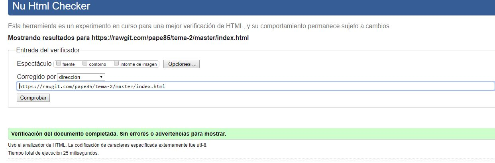

# TEMA 2
## ___Creacion de página web___

Para la realizacion de la pagina web hemos tenido que tratar las imagenes para que pesara menos y redimensionarla. Para ello primero hemos redimensionado la imagen de una forma sencilla con paint como se muestra en la 

Acto seguido hemos comprimido la imagen en [tinypng.com](https://tinypng.com/). Podemos ver el proceso en la siguiente .

Otro de los pasos a realizar es la validacion de la página web, para ello abrimos la pagina de validacion [aquí](https://validator.w3.org/) y copiamos la url de nuestra web en rawgit, como se ve en la  nuestra página a pasado el proceso correctamente.

Por ultimo os dejo el [enlace](https://rawgit.com/pape85/tema-2/master/index.html) de mi web previamente pasado por rawgit.

